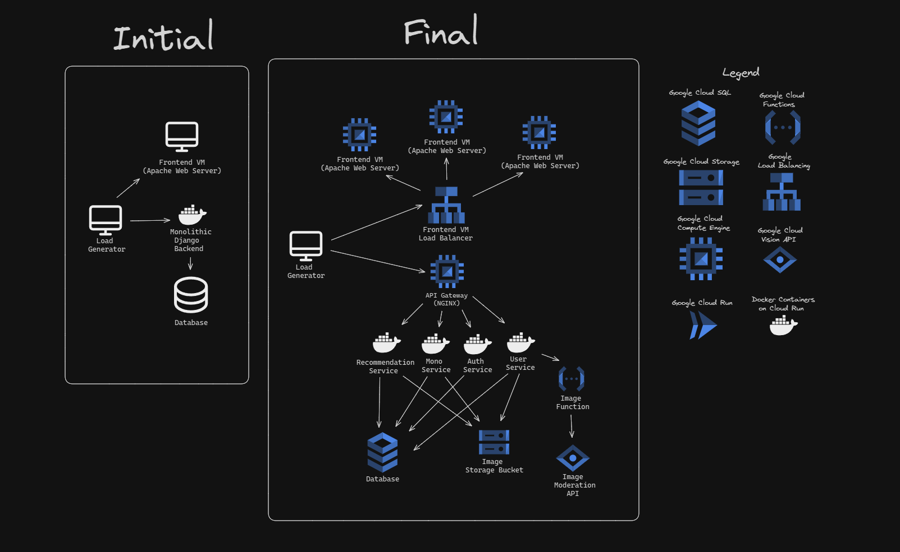

 
 <h1 align="center">
  Ovatify On The Cloud
 </h1>

This project involves redesigning and adapting [Ovatify](https://github.com/akifisitan/ovatify), a social music platform app, into a Cloud Native application as part of the [CS436 Cloud Computing](https://suis.sabanciuniv.edu/prod/bwckctlg.p_disp_course_detail?cat_term_in=202302&subj_code_in=CS&crse_numb_in=436) course.

[Project Demo Video Link](https://youtu.be/09V5-cXKohY)

## Cloud Architecture

### Frontend

- 3 Virtual machines running on Google Cloud Compute Engine on Ubuntu 22.04 running Apache Web Server for serving static assets
- Google Cloud VM Load Balancer for load balancing VMs

### Backend

- An Ubuntu 22.04 VM running NGINX server as API gateway for the services
- 4 containerized micro services each running on their own Google Cloud Run service instance with auto-scaling
- Database running on Google Cloud SQL
- Image storage bucket running on Google Cloud Storage
- Image function running on Google Cloud Functions and calling

For a visualization, see below

## Contributors

Akif Işıtan 29354

Bilal Berkam Dertli 29267

Mehmet Enes Onuş 29353

Abdulrahman Yunis 30526
