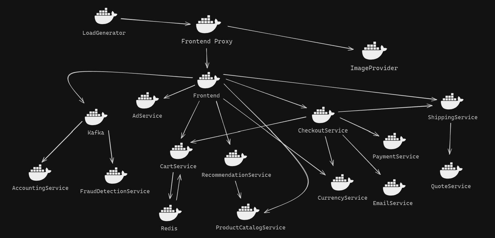

#  CS436 Term Project - Open Telemetry

## Project Overview

This project is a collaborative effort aimed at exploring the benefits and functionalities of cloud-native applications. By leveraging OpenTelemetry's demo project, we gain insights into service orchestration, scalability, and the observability of microservices. The demo includes a variety of services, each running in its container, and utilizes tools like Locust for load generation, as well as Jaeger and Grafana for observability.

### Cloud Services

We are utilizing Google Cloud to host the microservices as containers using Google Cloud Run, ensuring a seamless and scalable cloud environment.

### Service Deployment

Our deployment strategy involves using Kubernetes for orchestration, allowing us to manage and dynamically scale the services. Each service is containerized to maintain consistency and isolation across the deployment.

### Telemetry and Monitoring

The OpenTelemetry collector is deployed within our Kubernetes cluster to gather telemetry data from all microservices. We have configured exporters in the collector to send metrics and traces to Prometheus and Jaeger, respectively, enabling detailed observability and monitoring.

### High Availability

To ensure high availability, we have planned for multi-zone or multi-region deployment in the cloud. This approach guarantees that our services remain accessible and resilient across various scenarios.

### Scalability

Our system is designed to automatically scale with variations in load, leveraging both Kubernetes auto-scaling features and Google Cloud's auto-scaling capabilities. This ensures that our services can handle increased traffic without manual intervention.

## Cloud Architecture Visualization

## Quick start

You can be up and running with the demo in a few minutes. Check out the docs for
your preferred deployment method:

- [Docker](https://opentelemetry.io/docs/demo/docker_deployment/)
- [Kubernetes](https://opentelemetry.io/docs/demo/kubernetes_deployment/)
